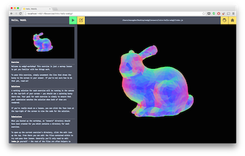
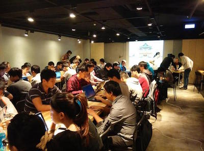
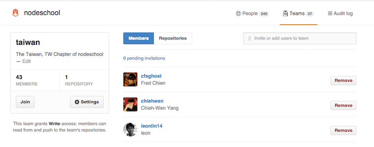

# NodeSchool Newsletter #1

Welcome to the first NodeSchool newsletter! 

### Workshop Spotlight: [`webgl-workshop`](https://npmjs.org/webgl-workshop)

In preparation for the latest [Camp.js](http://campjs.com/), a JavaScript focused "summer camp" style event that happens regularly in the Australian Hinterland, 3D graphics wizards [@hughsk](https://github.com/hughsk) and [@mikoalysenko](https://github.com/mikolalysenko) of the [stack.gl](http://stack.gl/) crew created a new workshop for learning WebGL from the ground up using small modules.

[`webgl-workshop`](https://npmjs.org/webgl-workshop) is the sequel to their previous workshop [`shader-school`](http://npmjs.org/shader-school), which focuses on graphics programming fundamentals with the GLSL language. `shader-school` has been one of the most interesting NodeSchool workshops because it's one of the only ones that doesn't involve any JavaScript. The new `webgl-workshop` builds on the GLSL shader fundamentals and dives into the world of JavaScript based 3D programming using WebGL.

### Who will be the 50th Chapter?

A couple of months ago NodeSchool Chapters were introduced, and we now have **47** registered chapters around the world! To start a chapter you simply [apply for membership by opening a GitHub issue](https://github.com/nodeschool/organizers#organizers-) and then you set up the infrastructure for your repo, all on GitHub:

### Event Spotlight: NodeSchool Taiwan

At the recent JSDC conference in Taipei, Taiwan the topic of "Why isn't there a NodeSchool chapter in Taiwan yet?" came up. Then with only 24 hours notice (!!!) [@clonn](https://github.com/clonn) and the JSDC team got **60** attendees to come to the first dedicated NodeSchool Taiwan event. It was hosted in partnership with the [Mozilla Taiwan Community Space](http://moztw.org/space/) in Taipei. They have a awesome event space next door to their regular community space that they rented out for the evening so we could hold all of the NodeSchoolers.

The event went from 7 - 10PM. We started with me (@maxogden) doing an intro to nodeschool and `learnyounode`, which was live translated into Chinese. I also showed people [http://generalhenry.com/](http://generalhenry.com) as a fallback in case they couldn't get `learnyounode` installed.

After a few minutes [@substack](https://github.com/substack) mentioned that he had recently found the [javascripting](http://npmjs.org/javascripting) workshop by [@sethvincent](https://github.com/sethvincent), so we decided to tell attendees about it. Sure enough a lot of attendees lacked a lot of JS experience and immediately switched from `learnyounode` to `javascripting`. 

Two women who attended, who both work at [http://womany.net/](http://womany.net/), a lifestyle blog for women in Taiwan, stayed late and finished the `javascripting` workshop and are now planning on starting a regular class to get more women in Taiwan into web development by hosting `javascripting` workshops as a sort of gentle introduction to NodeSchool in general.

I also tried a new technique that worked pretty well: using NodeSchool and GitHub stickers as bait to get people to register on the Taiwan NodeSchool Team. Basically we announced that if you want NodeSchool + GitHub stickers you can come up to the front and enter your GitHub username into my laptop. I had them enter it into the 'Invite or add users to this team' field of the Taiwan team page under the NodeSchool org on GitHub. This page is not publicly viewable for some reason (I emailed GitHub today to ask why this is) but it looks like this:

Now we have ~50 people on the Taiwan team, which means they can use the [nodeschool/taiwan](https://github.com/nodeschool/taiwan) repo as a discussion board to talk about nodeschool stuff and plan future events in Chinese.

## Thanks for reading!

This concludes the first newsletter. There will be more in the future! You can find the source markdown for all newsletters [here](https://github.com/nodeschool/newsletter).

## Things we need help with

NodeSchool is fully volunteer run. Nobody gets paid to work on anything and everything is open source. If you want to get involved here are some suggestions:

- [Internationalizing workshop content]()
- [Documentation about how to run a chapter](https://github.com/nodeschool/organizers/issues/48)
- Fielding questions from workshop learners (click [watch](https://github.com/nodeschool/discussions) to subscribe to questions)
